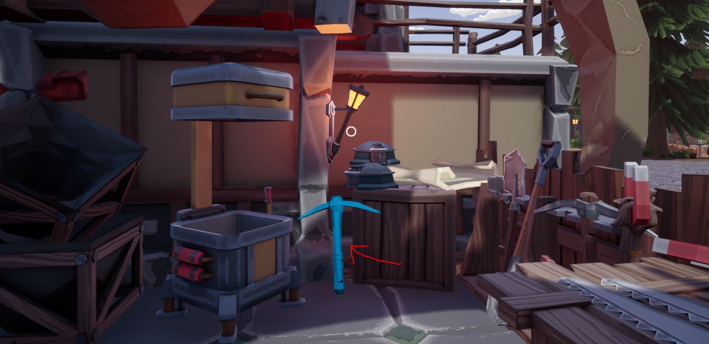
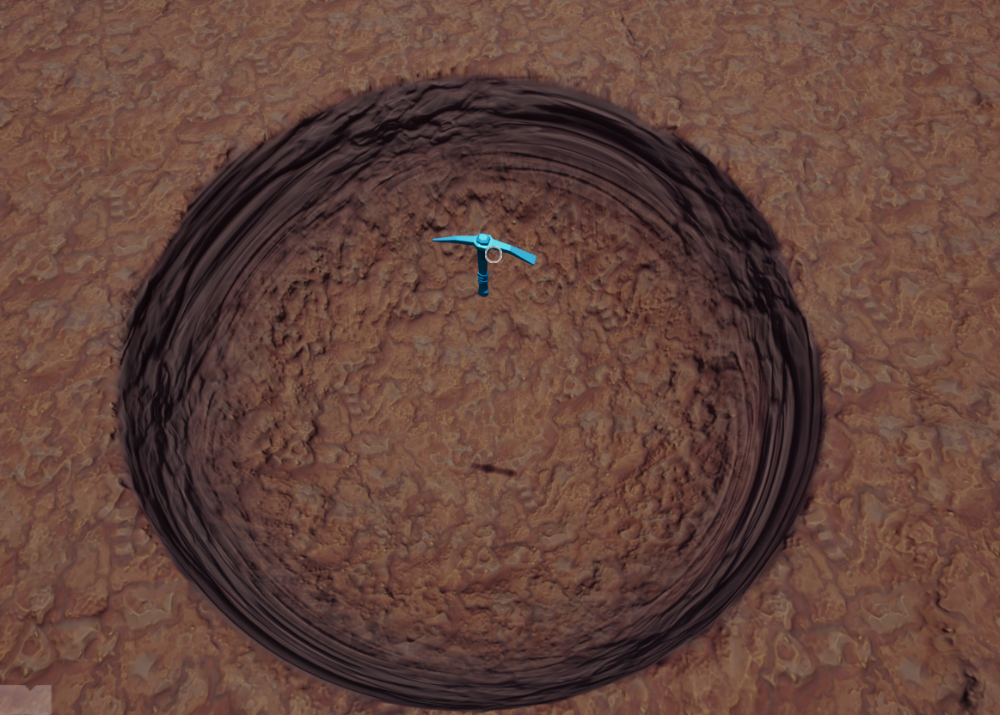

# BetterPickaxe

Your way to remove dirt (;

## Creators

- Gamerkuipers

-------

## Downloads

- [BetterPickaxe](https://github.com/Gamerkuipers/Hydroneer-Modding/raw/main/1.x/500-BetterPickaxe_P.pak)

### Required mods

- [HydroUMH](https://github.com/RHlNO/HydroneerModding/raw/main/Release%20Mods/501-HydroUMH_P.pak)

-------

## Where do I buy it?

You can buy it at the "Tools and equipment" Store in Bridgepour (image below)

-------

## How do i use it?

left click on dirt (; (example of the hole below)

-------

## issues

    - Can't put it on a toolrack
-------

## [More mods](../../../)
