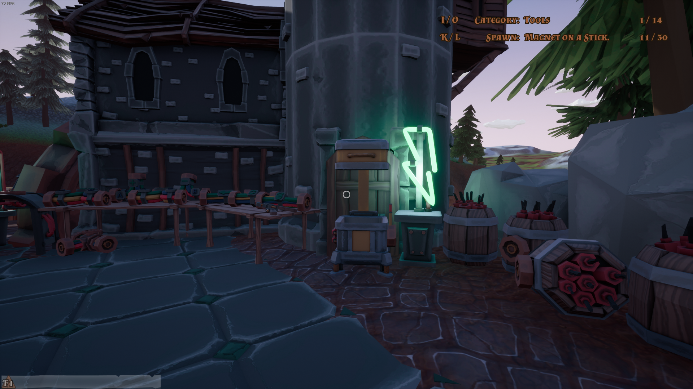

# Logic Compressor
Just your normal gem compressor but now with logic ;) [Download here](https://github.com/Gamerkuipers/Hydroneer-Modding/blob/main/LogicCompressor/500-LogicCompressor_P.pak) 

## Required mods
- [HydroUMH](https://github.com/RHlNO/HydroneerModding/raw/main/Release%20Mods/501-HydroUMH_P.pak)

## Where can you buy it?
You can buy it in "Hobson's Powerworks" (Power and Logic) store next to the logic on the right side (picture below) for 7230 HydroCoins

## How do you use it?
The Logic compressor activates when it gets a value of 1 or above. The logic is on the right side with the handle just plug in your logic cable there and then you're all set.

## [Go back](./)