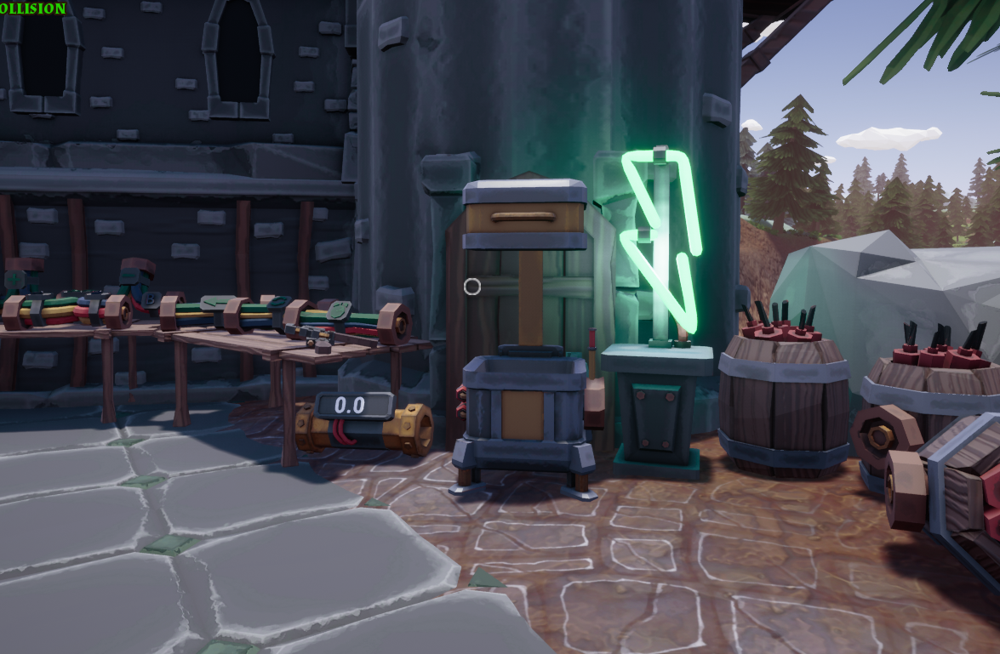

# Logic Items
- Logic Compressor
- Pressure Display

## Where can you buy Them?
You can buy it in "Hobson's Powerworks" (Power and Logic) store next to the logic on the right side (picture below)

## How do you use Them?

- ## Logic Compressor
     - The Logic compressor activates when it gets a value of 1 or above. The logic is on the right side with the handle just plug in your logic cable there and then you're all set.

- ## Pressure Display
    - Plug it in on your water system and done it will display the current pressure

## [Go back](./)