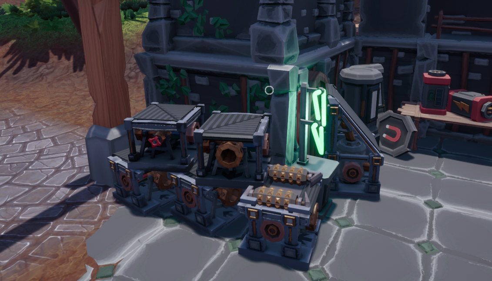

# Logic Belts

Your ingame belts but you can turn the valve with logic. 1+ to open the valve and 0 to close the valve. 

## Where can you buy those?

You can buy it in "Hobson's Powerworks" (Power and Logic) store next to the entrance on the left side (picture below)

## How do you use it? 

You can turn the valve on the belt using logic. 1+ to open the valve (allow water go thru) and 0 to close the valve (stops the water flow).

## Why would i use it?

Its a alternative way of the magnet you can use it in a autosmelting system. You send 0 into the belt to stop the ore and start the smelting process and a 1 when the smelting process is done. I recommend incasing the belt bc the first few ores shoot out but after it will nicely pile up

## [Go back](./)