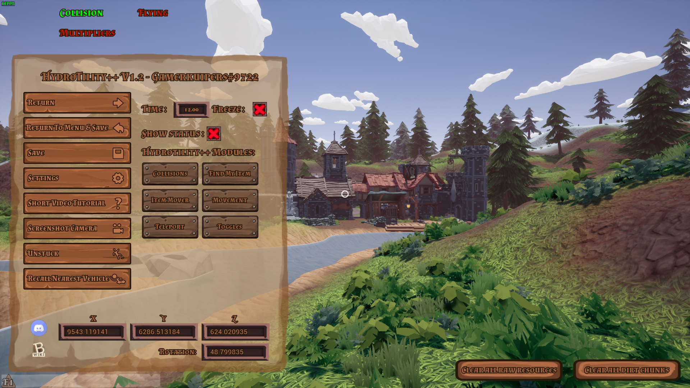
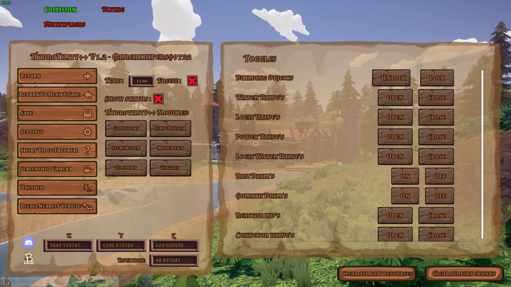
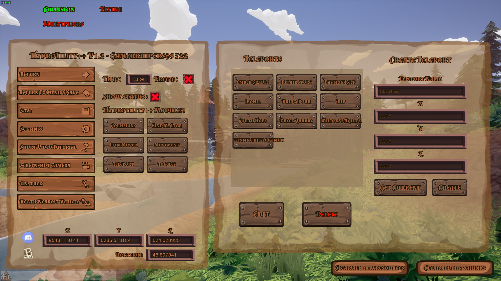

# Hydrotility++

Allows you to change/freeze time. And gives Quit to desktop! Allows the Possibility to use modules (seperate mods) [Download Here](https://github.com/Gamerkuipers/Hydroneer-Modding/raw/main/Hydrotility++/500-Hydrotility++_P.pak)

Download Complete pack (Includes Hydrotility++ And ALL Modules) [Download Here](https://github.com/Gamerkuipers/Hydroneer-Modding/raw/main/Hydrotility++/Hydrotility++_Complete.zip)

## Required mods

- [HydroUMH](https://github.com/RHlNO/HydroneerModding/raw/main/Release%20Mods/501-HydroUMH_P.pak)

-----------

## Keybinds

- Hydrotility++ ([Download Here](https://github.com/Gamerkuipers/Hydroneer-Modding/raw/main/Hydrotility++/500-Hydrotility++_P.pak))
  - `ESC` : Open Menu
- Movement Module ([Download Here](https://github.com/Gamerkuipers/Hydroneer-Modding/raw/main/Hydrotility++/Modules/500-ModuleMovement_P.pak))
  - `F` : Toggle Fly
  - `SPACE (Jump)` : Fly Up
  - `C (Crouch)` : Fly Down
  - `LeftSHIFT` : Sprint (modifier also works on fly)
  - `Ctrl+F1` : Toggle Modifiers
- Collision Module ([Download Here](https://github.com/Gamerkuipers/Hydroneer-Modding/raw/main/Hydrotility++/Modules/500-ModuleCollision_P.pak))
  - `G` : Toggle Collision

-----------

## Features

- Quit to desktop
- Change time
- Freeze time
- Read Coordinates Location
- Add modules to the esc menu

-----------

## Modules

**REQUIRED MOD:** [Hydrotility++](https://github.com/Gamerkuipers/Hydroneer-Modding/raw/main/Hydrotility++/500-Hydrotility++_P.pak)

- Teleports [Download Here](https://github.com/Gamerkuipers/Hydroneer-Modding/raw/main/Hydrotility++/Modules/500-ModuleTeleport_P.pak)
  - Teleport to Locations
  - Create Custom Teleports
  - Edit Custom Teleports
  - Delete Custom Teleports
- Movement [Download Here](https://github.com/Gamerkuipers/Hydroneer-Modding/raw/main/Hydrotility++/Modules/500-ModuleMovement_P.pak)
  - Toggle Fly (on/off)
  - Toggle the modifiers (on/off)
  - Modify Fly speed
  - Modify Acceleration
  - Modify Walking speed
  - Modify Sprint Speed
  - Modify JumpHeight
  - Modify Gravity
- Toggles [Download Here](https://github.com/Gamerkuipers/Hydroneer-Modding/raw/main/Hydrotility++/Modules/500-ModuleToggles_P.pak)
  - Toggle Lock/Unlock all buildings
  - Toggle Water Valve's
  - Toggle Logic Valve's
  - Toggle Power Valve's
  - Toggle Logic Water Valve's
  - Toggle Ram Drill's
  - Toggle Goliath Drill's
  - Toggle Reactor lid's
  - Toggle Conveyor valve's
- Collisions [Download Here](https://github.com/Gamerkuipers/Hydroneer-Modding/raw/main/Hydrotility++/Modules/500-ModuleCollisions_P.pak)
  - Toggle Collision
  - Choose what collision channels you wanna toggle

-----------

## [More mods](../../../)

## Screenshots

### Main UI

### Module Collisions

### Module Movement

### Module Toggles

### Module Teleports

