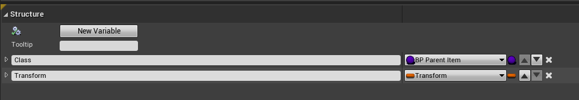
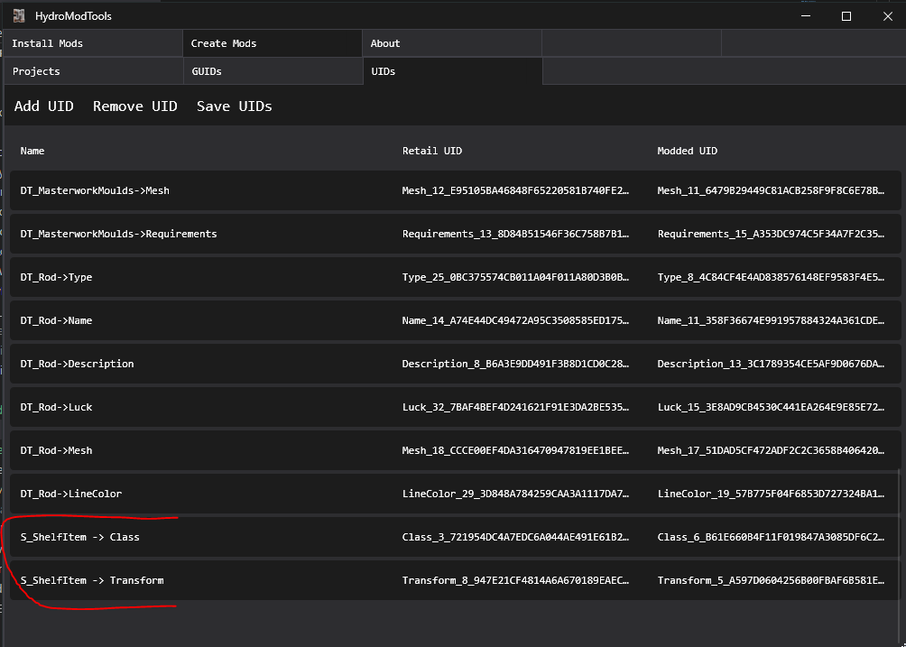
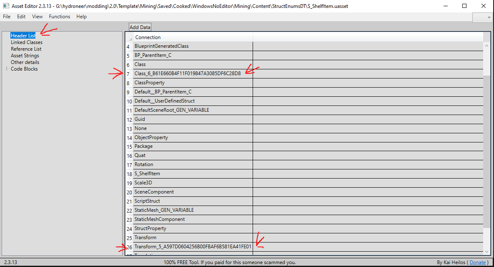

# ModdedToolRack

This mod replaces the ingame toolrack so it can accept tools that other mods add. Its not up to this mod to add items to the toolracks so mods that have tools will need to be updated so that they will use this mod to add them to the toolrack.

## Creators

- Gamerkuipers

-----------

## Downloads

- [ModdedToolRack](https://github.com/Gamerkuipers/Hydroneer-Modding/raw/main/2.x/ModdedToolRack_P.pak)

### Required mods

- This mod requires no other mod.

### Mod Creators

For Mod Creators Download this [zip](https://github.com/Gamerkuipers/Hydroneer-Modding/raw/main/ModdedToolRack/ModdedToolRack.zip) And add the `Gamerkuipers` folder to the Content Folder. 2 things need to happen we need to make sure `S_ShelfItem` is setup correctly and implementing the interface.

#### Setting up the interface

- Then in the hook of your mod add the interface to the blueprint.
  - to add a interface to an blueprint hit class settings at the top and in the details panel (most likely on the right) go to the interfaces section hit add and search for `BPI_ModdedToolRack`.
- add the interface function `Get Tools`.
  - you will find it in the `MyBlueprint` panel (most likely on the left) under interfaces Right click `Get Tools` and choose implement
- Open the function and create a variable for the output of the function or create and array there.

### Making sure S_ShelfItem is correct

You will have to press add UID at the top. The Modded UID's will be different as i have changed them so you would need to get them using the `asset editor` tool and then opening the cooked file in `your project` named `S_ShelfItem.uasset` and then in the header list (image below)

#### Retail UID's

- Class: `Class_3_721954DC4A7EDC6A044AE491E61B2705`
- Transform: `Transform_8_947E21CF4814A6A670189EAEC7632598`

#### Modding tool chain

#### Asset Editor

Below you will find a table of the transform for each retail item.

Tool name | Location(x,y,z) | Rotation(x,y,z)
:--: | :--: | :---:
Shovel T1 | 0 , 0 , 13 | 0 , 0 , -90
Shovel T2 | 3 , 0 , 0 | 0 , 0 , -90
Pickaxe T1 | 3 , 0 , -38 | 0 , 0 , 0
Pickaxe T2 | 3 , 0 , -38 | 0 , 0 , 0
Brush | 0 , 0 , -8 | 0 , 0 , -90
Construction Hammer | 0 , 0 , -40 | 0 , 0 , 0
Blacksmith Hammer | 0 , 0 , -34 | 0 , 0 , 0
Magnet On A Stick | 0 , 0 , -49 | -90 , 0 , -90
Saw | 0 , 10 , -60 | -90 , 0 , 180
Spanner | 0 , 0 , -14 | 0 , 0 , 0
Magnifying Glass | 1 , 35 , -38 | -25 , 36 , 53
Gravity Tool | 0 , 0 , -58 | -90 , 0 , 0
Creative Wand | 0 , 0 , -33 | 0 , 0 , 0
Rake T1 | 0 , 0 , 14 | 0 , 0 , 90
Rake T2 | 0 , 0 , 14 | 0 , 0 , 90

-----------

## [More mods](../../../)
