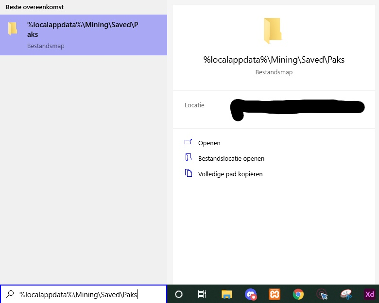
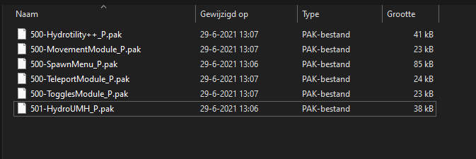

# Gamerkuipers's Mods for Hydroneer

- [Get Hydroneer](https://store.steampowered.com/app/1106840/Hydroneer/)
- [Hydroneer Wiki](https://bridgepour.com/)

In this Repository you will find all the mods I host for Hydroneer. My own mods and mods I made together with others aswell as hosting mods for other creators

## Required For **ALL MODS**

- [HydroUMH](https://github.com/RHlNO/HydroneerModding/raw/main/Release%20Mods/501-HydroUMH_P.pak)

## Current mods

Name | Description | Required mods | Creators | Mod
:----:|:---------:|:------:|:-----: | :----:
[Gamers Logic](./Gamers_Logic) | Adds a variaty of logic and power items to the game | | Gamerkuipers | [Download](https://github.com/Gamerkuipers/Hydroneer-Modding/raw/main/Gamers_Logic/500-Gamers_Logic_P.pak)
[Hydrotility](./Hydrotility) | Adds lots of new settings to hydroneer  |  | Gamerkuipers | [Download](https://github.com/Gamerkuipers/Hydroneer-Modding/raw/main/Hydrotility/500-Hydrotility_P.pak)
[BetterPickaxe](./BetterPickaxe) | your way to remove dirt! |  | Gamerkuipers | [Download](https://github.com/Gamerkuipers/Hydroneer-Modding/raw/main/BetterPickaxe/500-BetterPickaxe_P.pak)
[F4T4L_WaterPipes](./F4T4L_WaterPipes) | Adds various pipes to Hydroneer! |  | F4T4L & Gamerkuipers | [Download](https://github.com/Gamerkuipers/Hydroneer-Modding/raw/main/F4T4L_WaterPipes/500-f4t4l_WaterPipes_P.pak)
[F4T4L_Rocks](./F4T4L_Rocks) | Adds lots Decorations e.g.(rocks, trees, walls, etc.) to Hydroneer! | [SpawnMenu](https://github.com/RHlNO/HydroneerModding/raw/main/Release%20Mods/500-SpawnMenu_P.pak) | F4T4L & Gamerkuipers | [Download](https://github.com/Gamerkuipers/Hydroneer-Modding/raw/main/F4T4L_Rocks/500-f4t4l_Rocks_P.pak)
[F4T4L_PowerCables](./F4T4L_PowerCables) | Adds a 3way corner PowerCable to Hydroneer! | | F4T4L & Gamerkuipers | [Download](https://github.com/Gamerkuipers/Hydroneer-Modding/raw/main/F4T4L_PowerCables/500-f4t4l_PowerCables_P.pak)
[F4T4L_LogicCables](./F4T4L_LogicCables) | Adds a 3way corner LogicCable to Hydroneer! | | F4T4L & Gamerkuipers | [Download](https://github.com/Gamerkuipers/Hydroneer-Modding/raw/main/F4T4L_LogicCables/500-f4t4l_LogicCables_P.pak)

## Downloading mods

## **Step 1**

Download a mod thru the wiki [Link here](https://bridgepour.com/legacy-mods) or from the links above on the right side press download.

## **Step 2**

go to the paks folder on your system type `%localappdata%\Mining\Saved\Paks` in the windows search and hit enter

## **Step 3**

Once the pak folder is open you can place the mod you downloaded into the paks folder and done you installed mods :) (example below)

## Special Thanks

- [ResaloliPT](https://github.com/ResaloliPT/HydroModTool) For his Amazing Modding tool which makes life so much better!
- [GrandmaMax](https://twitter.com/MaxHayon) The Creator of Hydroneer
- [Rhino](https://github.com/RHlNO/HydroneerModding) For HydroUMH making it possible to load mods and his amazing spawn menu [Download here](https://github.com/RHlNO/HydroneerModding/raw/main/Release%20Mods/500-SpawnMenu_P.pak) making the life of testing a lot easier
- [F4T4L](/#) A fantastic dude who got the best out of me ;)
