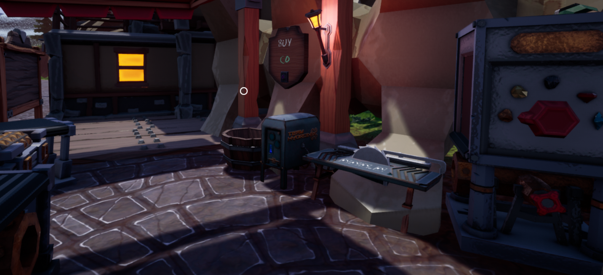

# TableSaw

Cut bars to your desired size.

## Creators

- Team Hydronix
- Repaired by Gamerkuipers

-------

## Downloads

- [TableSaw](https://github.com/Gamerkuipers/Hydroneer-Modding/raw/main/1.x/500-TableSaw_P.pak)

### Required mods

- [HydroUMH](https://github.com/RHlNO/HydroneerModding/raw/main/Release%20Mods/501-HydroUMH_P.pak)

-------

## Where do I buy it?

You can buy it at the "Conveyor Nation" Store in Bridgepour (image below)

-------

## How do i use it?

Make sure the tablesaw is connect to water!

Hold the bar in your hand and then left click on the tablesaw to place the bar into position.
Then select the amount you want to cut of the bar by clicking on the numbers on the tablesaw.
Once you have select your desired amount click the button to cut the bar.

-------

## issues

    none

-------

## [More mods](../../../)
